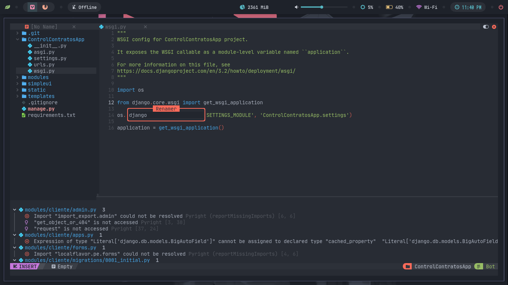
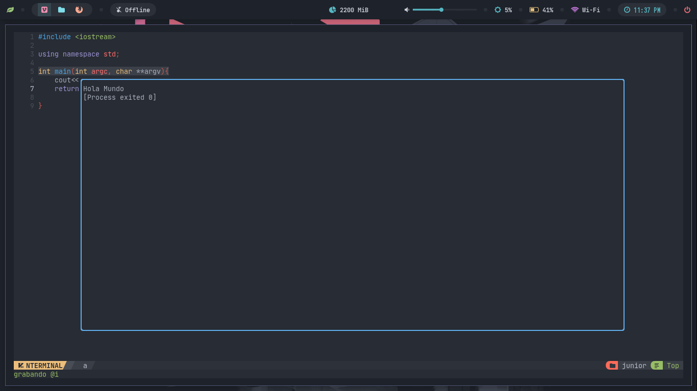
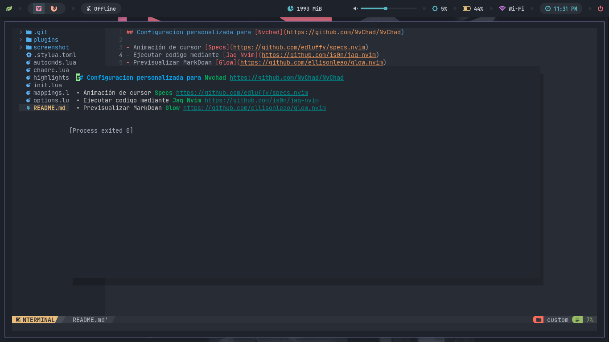
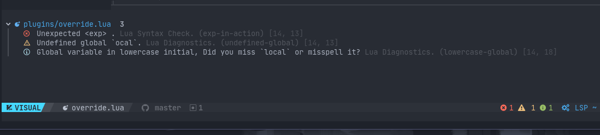

## Configuracion personalizada para [Nvchad](https://github.com/NvChad/NvChad)

- Animación de cursor [Specs](https://github.com/edluffy/specs.nvim)

- Ejecutar codigo mediante [Jaq Nvim](https://github.com/is0n/jaq-nvim)

- Previsualizar MarkDown [Glow](https://github.com/ellisonleao/glow.nvim)

- Un bonito diseño para los diagnosticos [Trouble](https://github.com/folke/trouble.nvim)

